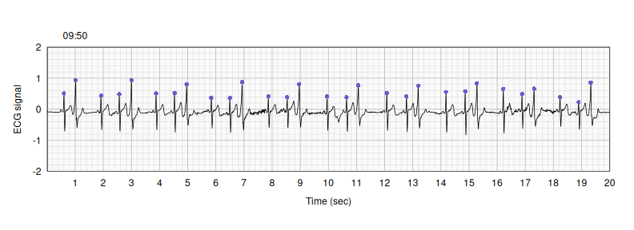
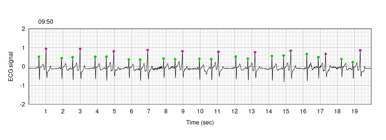

## detectPVC - detect premature ventricular complexes with Polar H10 <a href="https://github.com/kbroman/detectPVC"></a>

[](https://github.com/kbroman/detectPVC/actions/workflows/R-CMD-check.yaml)
[](https://kbroman.r-universe.dev/detectPVC)
[](https://zenodo.org/doi/10.5281/zenodo.11174768)

R package to detect [_premature ventricular complexes
(PVCs)_](https://en.wikipedia.org/wiki/Premature_ventricular_contraction)
in data from a [Polar H10](https://www.polar.com/us-en/sensors/h10-heart-rate-sensor)
chest-strap heart rate sensor.

We have used the [ECGLogger app](https://www.ecglogger.com/) on an iPhone
to extract the Polar H10 data as a CSV file (or really a series of CSV
files, in one hour blocks), and the [rsleep](https://rsleep.org/)
package to detect "R" peaks in the ECG signal.


---

### Installation

You can install the detectPVC package from
[R-universe](https://kbroman.r-universe.dev/detectPVC).


``` r
install.packages("detectPVC", repos="https://kbroman.r-universe.dev")
```

Alternatively, install it from [GitHub](https://github.com/kbroman/detectPVC).
You first need to install the [remotes](https://remotes.r-lib.org) package.


``` r
install.packages("remotes")
```

Then use `remotes::install_github()`:


``` r
library(remotes)
install_github("kbroman/detectPVC")
```

---

### Usage

The library comes with a 10-min sample data set, `polar_h10`.


``` r
library(detectPVC)
data(polar_h10)
```


Convert the included times (which are time stamps from a Polar H10, in
1e-9 seconds) to standard date-time values.


``` r
polar_h10$datetime <- convert_timestamp(polar_h10$time)
```

First detect bad segments in the data, with either wild values or
missing data points.


``` r
bad_segs <- find_bad_segments(polar_h10$datetime, polar_h10$ecg)
```

For this example, there is just one bad segment, covering about
7 sec.
You can get the total covered length in seconds with `tot_length()`.


``` r
totlength(bad_segs, polar_h10$datetime)
```

```
## [1] 6.868205
```

Use `detect_peaks()` to detect "R" peaks in the ECG trace.


``` r
peaks <- detect_peaks(polar_h10$datetime, polar_h10$ecg, omit_segments=bad_segs)
```

Plot the first 20 seconds of data, and add points above the peaks. The function
`plot_ecg()` is a base-graphics-based plotting function with light
gray grid lines.


``` r
v <- get_time_interval(polar_h10$datetime, start=polar_h10$datetime[1], length=20)
plot_ecg(polar_h10$datetime[v], polar_h10$ecg[v])
points(polar_h10$datetime[peaks], polar_h10$ecg[peaks], pch=16, col="slateblue")
```



Use `calc_peak_stats()` to calculate some statistics about each peak.


``` r
peak_stats <- calc_peak_stats(polar_h10$datetime, polar_h10$ecg, peaks)
```

The simplest rule for classifying PVCs is to take `RStime > 50`.
The statistic `RStime` is the time between the R and S peaks in milliseconds.


``` r
pvc <- (peak_stats$RStime > 50)
```

Label the inferred PVCs with pink dots, and the others with green
dots.


``` r
plot_ecg(polar_h10$datetime[v], polar_h10$ecg[v])
points(polar_h10$datetime[peaks], polar_h10$ecg[peaks], pch=16, col=c("green3", "violetred")[pvc+1])
```



In this 20 second window,
there are 10 PVCs
in 29 total beats.

---

### License

[detectPVC](https://github.com/kbroman/detectPVC) is released under the
[MIT license](LICENSE.md).
